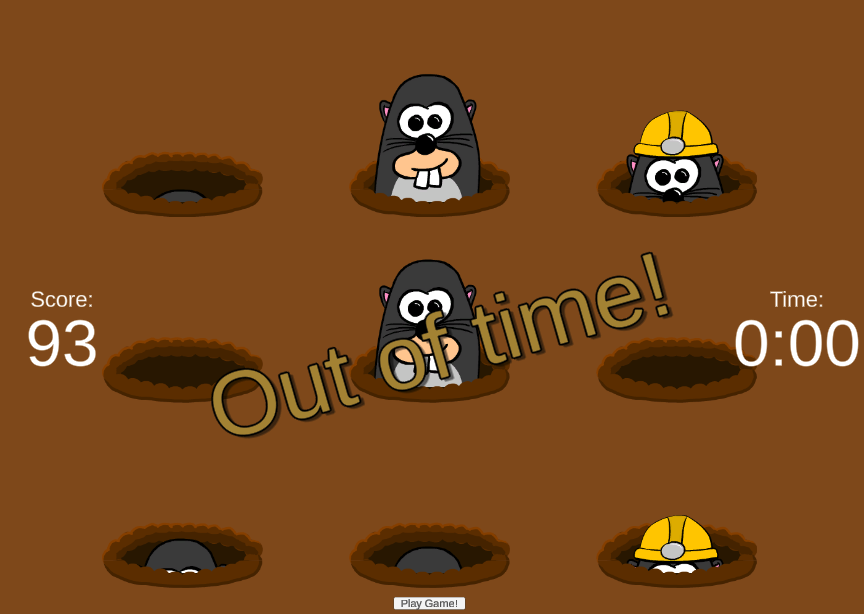

# Whack-a-Mole Dojo Game

A blockchain-powered Whack-a-Mole built with **Unity** and **Dojo** on **Celestia**.

<div align="center">
  
</div>

---

## Repository Structure

- **backend/** – Cairo smart contracts (Dojo)  
- **unity/** – Unity frontend  
- **docs/** – Technical documentation

---

## Prerequisites

This repo stores Unity asset bundles and other binaries with **Git LFS**.

```bash
brew install git-lfs   # or use your package manager
git lfs install        # run once
```

---

## Quick Start

1.  Clone the repository (after installing Git LFS).
2.  [Set up and run the Dojo backend](docs/backend.md#local-development) *(Dojo)*.
3.  [Configure and run the Unity client](docs/unity.md#setup).
4.  Play the game!

---

## Documentation

| Area | File |
|------|------|
| Architecture Overview | [`docs/architecture.md`](docs/architecture.md) |
| Backend (Dojo) | [`docs/backend.md`](docs/backend.md) |
| Unity Frontend | [`docs/unity.md`](docs/unity.md) |
| Development Workflow | [`docs/development.md`](docs/development.md) |

---

## Contributing

Pull requests are welcome! Please ensure any code changes are covered by appropriate docs updates.

---

## Credits

This project is built upon the original [Whack-A-Mole](https://github.com/Firnox/Whack-A-Mole) game created by [Firnox](https://www.youtube.com/@FirnoxGames). We extend our sincere gratitude for their excellent work which provided the foundation for this blockchain integration demonstration. (original [YouTube video](https://www.youtube.com/watch?v=oqnr7THMbcU))

---

## License
[UNLICENSED](https://unlicense.org/)